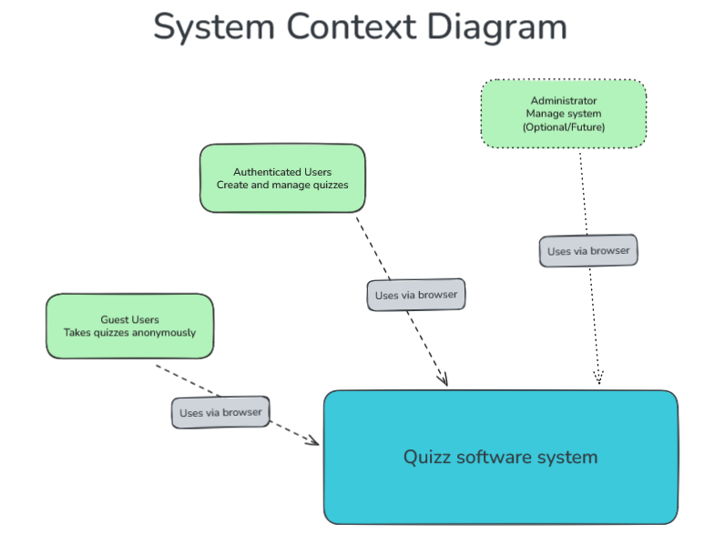
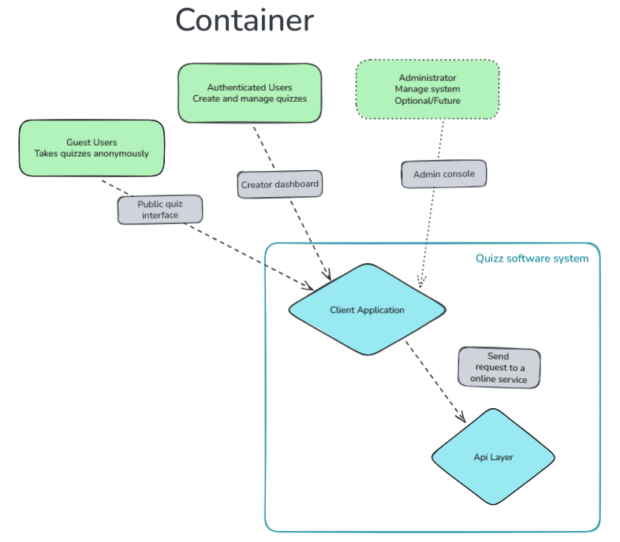
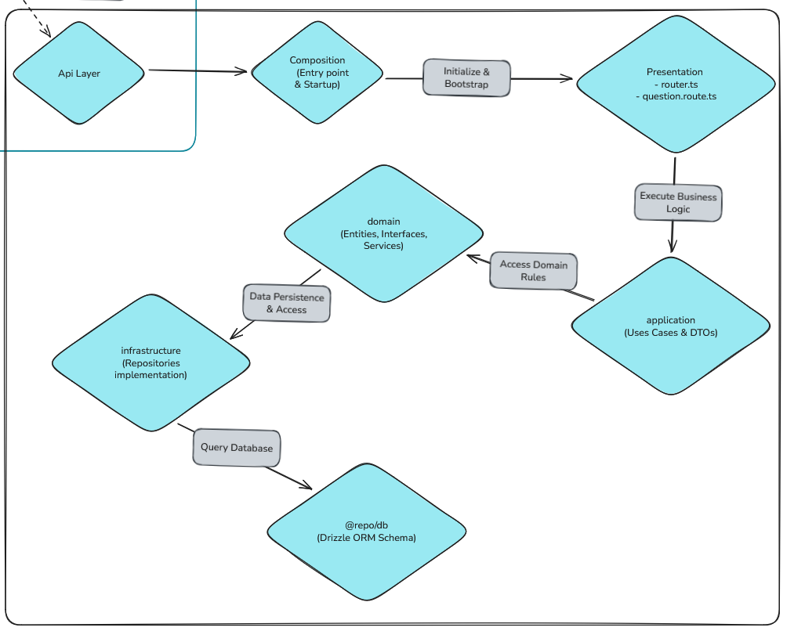
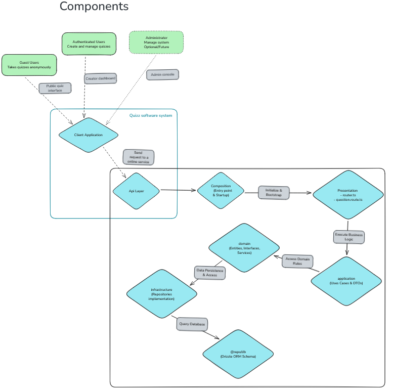
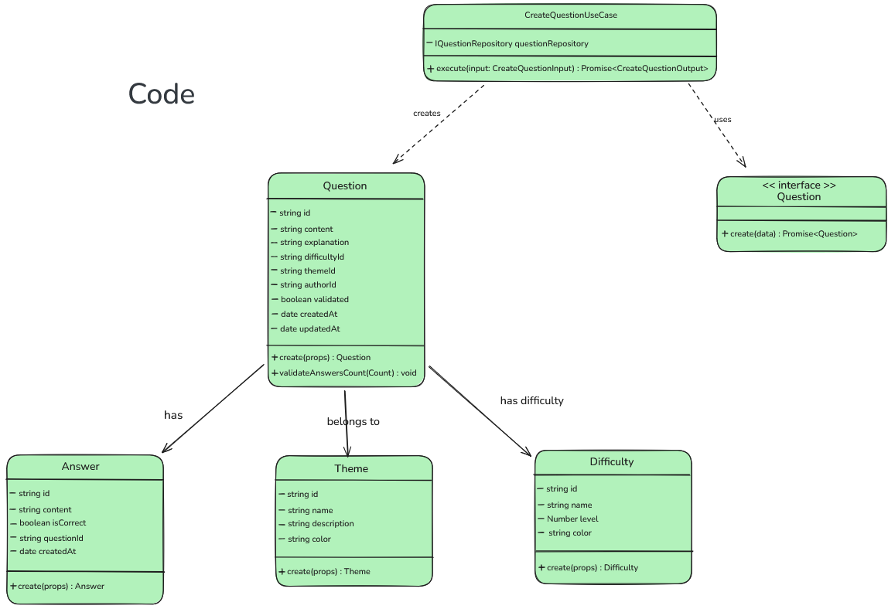

# Quiz Game 

Application de quiz full-stack moderne avec une architecture propre (DDD).

## Aperçu

Quiz Game permet de créer et jouer à des quiz sur différents thèmes. L'application propose :

- Authentification via SSO Discord 
- Création de questions avec 4 réponses possibles
- Organisation par thèmes et niveaux de difficulté
- Interface responsive et moderne
- Dashboard admin pour valider et modifier des questions

## Manuel Utilisateur

### Se connecter

1. Accédez à l'application via `http://localhost:3001`
2. Cliquez sur **"Connexion"** dans le menu
3. Connectez-vous avec votre compte **Discord** (authentification SSO)
4. Vous êtes redirigé vers votre tableau de bord

### Jouer à un quiz

1. Depuis la page d'accueil, cliquez sur **"Jouer"**
2. Sélectionnez un **thème** parmi ceux proposés (ex: Sciences, Histoire, Sport...)
3. Répondez aux questions en cliquant sur l'une des 4 réponses proposées
4. Chaque question n'a qu'**une seule bonne réponse**
5. Votre score est calculé en fonction :
   - Du nombre de bonnes réponses
   - De la difficulté des questions
   - De votre série de bonnes réponses consécutives (streak bonus)

### Soumettre une question

1. Connectez-vous à votre compte
2. Accédez à **"Proposer une question"** depuis le menu
3. Remplissez le formulaire :
   - **Contenu de la question** : votre question (max 500 caractères)
   - **Thème** : choisissez la catégorie appropriée
   - **Difficulté** : Facile, Moyen ou Difficile
   - **4 réponses** : entrez les 4 réponses possibles
   - **Réponse correcte** : cochez la bonne réponse (une seule)
   - **Explication** (optionnel) : ajoutez une explication pour la bonne réponse
4. Cliquez sur **"Soumettre"**
5. Votre question sera soumise à validation par un administrateur

### Consulter ses questions

1. Accédez à votre **Dashboard**
2. Visualisez la liste de vos questions soumises
3. Consultez leur statut : en attente de validation, validée ou refusée

### Administration (pour les admins)

1. Accédez au **Dashboard administrateur**
2. Visualisez les questions en attente de validation
3. Pour chaque question, vous pouvez :
   - **Valider** : la question sera disponible dans les quiz
   - **Modifier** : corriger le contenu ou les réponses avant validation
   - **Refuser** : la question ne sera pas publiée

## Prérequis

- [Bun](https://bun.sh/) >= 1.2
- [PostgreSQL](https://www.postgresql.org/) >= 14
- [Docker](https://www.docker.com/) (optionnel, pour le développement avec Docker)

## Installation

```bash
# Cloner le dépôt
git clone git@github.com:hlaclau/quiz-game.git
cd quiz-game

# Installer les dépendances
bun install

# Configurer les variables d'environement web et serveur (reprendre les .env.exemple)
# Appliquer le schéma de base de données
bun run db:push
```

## Lancement

```bash
# Développement (web + serveur)
bun run dev

# Ou séparément
bun run dev:web      # Frontend → http://localhost:3001
bun run dev:server   # API → http://localhost:3000
```

📚 Documentation OPENAPI disponible sur `http://localhost:3000/docs`

## Développement avec Docker

### Prérequis Docker

- Docker et Docker Compose installés

### Lancement avec Docker Compose

```bash
# Lancer tous les services (PostgreSQL + Server + Web)
docker-compose up

# Lancer en arrière-plan
docker-compose up -d

# Arrêter les services
docker-compose down

# Voir les logs
docker-compose logs -f

# Reconstruire les images
docker-compose build
```

Les services seront disponibles sur :
- **Frontend** → http://localhost:3001
- **API** → http://localhost:3000
- **PostgreSQL** → localhost:5432

### Configuration des variables d'environnement

Créez un fichier `.env` à la racine ou configurez les variables dans `docker-compose.yml` :
- `DISCORD_CLIENT_ID` : ID client Discord OAuth
- `DISCORD_CLIENT_SECRET` : Secret client Discord OAuth
- `CORS_ORIGIN` : Origine CORS autorisée (par défaut: http://localhost:3001)

### Base de données

La base de données PostgreSQL est automatiquement créée dans un volume Docker. Pour réinitialiser :

```bash
docker-compose down -v  # Supprime les volumes
docker-compose up       # Recrée tout
```

### Production

Pour la production, utilisez `docker-compose.prod.yml` :

```bash
docker-compose -f docker-compose.prod.yml up -d
```

Assurez-vous de configurer toutes les variables d'environnement nécessaires dans un fichier `.env` ou via les variables d'environnement du système.

## Stack Technique

| Couche | Technologies |
|--------|-------------|
| **Frontend** | React 19, TypeScript, TanStack Router/Start, TailwindCSS v4, shadcn/ui |
| **Backend** | Elysia, Bun, TypeScript |
| **Base de données** | PostgreSQL, Drizzle ORM |
| **Authentification** | Better-Auth (Discord OAuth) |
| **Qualité** | Biome (format et linting), Husky (pre-commit hooks), Turborepo, GitHub Actions (lancements des tests et linter lors des pull requests) |

## Architecture

### Diagrammes C4

#### System Context Diagram


#### Container Diagram




#### Components Diagram


#### Code Diagram


### Structure du Monorepo

```
quiz-game/
├── apps/
│   ├── web/        → Frontend React (TanStack Start)
│   └── server/     → API Elysia (DDD)
├── packages/
│   ├── auth/       → Configuration Better-Auth
│   ├── db/         → Schéma Drizzle ORM
│   └── config/     → Config TypeScript partagée
```

### Architecture de l'API (DDD)

L'API suit les principes du **Domain-Driven Design** avec une séparation stricte des couches :

```
apps/server/src/
├── domain/           → Logique métier pure (aucune dépendance externe)
│   ├── entities/     → Question, Answer, Theme, Difficulty
│   ├── interfaces/   → Contrats des repositories
│   ├── services/     → Services de validation et scoring
│   ├── value-objects/→ Objets valeur immuables
│   └── errors/       → Erreurs métier
│
├── application/      → Orchestration des cas d'usage
│   ├── use-cases/    → Un dossier par fonctionnalité
│   └── dtos/         → Objets de transfert de données
│
├── infrastructure/   → Implémentations concrètes
│   ├── repositories/ → Repositories Drizzle
│   └── container.ts  → Injection de dépendances
│
└── presentation/     → Routes HTTP Elysia
    ├── *.routes.ts   → Points d'entrée REST
    └── middleware/   → Middleware d'authentification
```

### Règle des Dépendances

Les dépendances pointent toujours vers l'intérieur :

```
presentation → application → domain ← infrastructure
```

- **Domain** : Zéro dépendance externe, logique métier pure
- **Application** : Dépend uniquement des interfaces du domain
- **Infrastructure** : Implémente les interfaces, utilise le package DB (Drizzle)
- **Presentation** : Relie la couche application aux endpoints de l'API

## Patrons de Conception (Design Patterns)

Le projet utilise plusieurs design patterns classiques, organisés par catégorie :

### Patterns de Création

#### Singleton Pattern
Le conteneur IoC est implémenté comme un singleton global :

```typescript
// composition/container.ts
class Container {
  private factories = new Map<string, () => unknown>();
  private singletons = new Map<string, unknown>();

  singleton<T>(key: string, factory: () => T): void {
    if (!this.singletons.has(key)) {
      this.singletons.set(key, factory());
    }
  }

  resolve<T>(key: string): T {
    if (this.singletons.has(key)) {
      return this.singletons.get(key) as T;
    }
    // ...
  }
}

export const container = new Container(); // Instance unique
```

#### Factory Pattern
Les repositories sont créés via des fonctions factory :

```typescript
// composition/adapters.ts
export const createQuestionRepository = (): IQuestionRepository => {
  return new DrizzleQuestionRepository(db);
};

export const createThemeRepository = (): IThemeRepository => {
  return new DrizzleThemeRepository(db);
};
```

### Patterns Structurels

#### Adapter Pattern
Les repositories Drizzle adaptent l'interface de la base de données aux interfaces du domaine :

```typescript
// domain/interfaces/question-repository.interface.ts
export interface IQuestionRepository {
  create(input: CreateQuestionInput): Promise<Question>;
  findById(id: string): Promise<Question | null>;
  findAll(): Promise<Question[]>;
}

// infrastructure/repositories/question.repository.ts
export class DrizzleQuestionRepository implements IQuestionRepository {
  constructor(private readonly db: DrizzleClient) {}
  // Adapte les appels Drizzle ORM vers l'interface du domaine
}
```

#### Repository Pattern
Abstraction de l'accès aux données via des interfaces :

```typescript
// Le domaine définit le contrat
export interface IQuestionRepository {
  create(input: CreateQuestionInput): Promise<Question>;
  findById(id: string): Promise<Question | null>;
}

// L'infrastructure fournit l'implémentation
export class DrizzleQuestionRepository implements IQuestionRepository {
  // Implémentation concrète avec Drizzle ORM
}
```

### Patterns Comportementaux

#### Strategy Pattern
Le service de scoring utilise une configuration injectable permettant de changer l'algorithme de calcul :

```typescript
// domain/services/quiz-scoring.service.ts
export interface ScoringConfig {
  basePointsPerQuestion: number;
  streakBonusMultiplier: number;
  maxStreakBonus: number;
  difficultyMultipliers: Map<number, number>;
}

export class QuizScoringService {
  constructor(private readonly config: ScoringConfig = DEFAULT_SCORING_CONFIG) {}

  calculateRoundScore(results: AnswerResult[]): QuizScoreSummary {
    // Utilise this.config pour calculer le score
    // On peut injecter différentes stratégies de scoring
  }
}
```

#### Use-Case Pattern (Command)
Chaque opération métier est encapsulée dans un use-case dédié :

```typescript
// application/use-cases/create-question/create-question.use-case.ts
export class CreateQuestionUseCase {
  constructor(private readonly questionRepository: IQuestionRepository) {}

  async execute(input: CreateQuestionInput): Promise<CreateQuestionOutput> {
    QuestionValidationService.validate({ content: input.content, answers: input.answers });
    const question = await this.questionRepository.create(input);
    return { data: toDTO(question) };
  }
}
```

## Scripts Disponibles

| Commande | Description |
|----------|-------------|
| `bun run dev` | Lance web + serveur |
| `bun run dev:web` | Lance le frontend (port 3001) |
| `bun run dev:server` | Lance l'API (port 3000) |
| `bun run build` | Build de production |
| `bun run check` | Lint et format (Biome) |
| `bun run check-types` | Vérification TypeScript |
| `bun run db:push` | Applique le schéma DB |
| `bun run db:studio` | Ouvre Drizzle Studio |
| `bun run db:generate` | Génère les migrations |
| `bun run db:migrate` | Exécute les migrations |

## Contribuer

### Workflow

1. Créer une branche depuis `dev`
2. Développer la fonctionnalité
3. S'assurer que les checks passent : `bun run check`
4. Lancer les tests : `bun test` (dans `apps/server`)
5. Créer une PR vers `dev`

### Ajouter une Fonctionnalité (Backend)

1. **Domain** → Définir l'entité et l'interface du repository
2. **Application** → Créer le use-case dans son dossier dédié
3. **Infrastructure** → Implémenter le repository avec Drizzle
4. **Container** → Enregistrer le use-case avec ses dépendances
5. **Presentation** → Ajouter les routes qui délèguent au use-case

### Conventions

- **Biome** gère le formatage et le linting
- **Interfaces** préfixées par `I` (ex: `IQuestionRepository`)
- **Routes API** préfixées par `/api/`
- **Commits** : conventionnal commits
