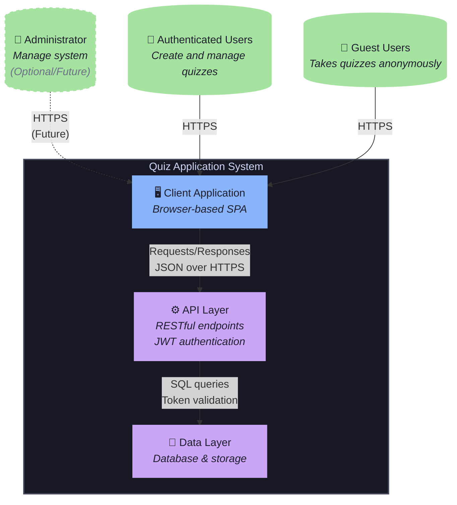

# Architecture Diagram

```mermaid
graph TB
    %% Actors
    Admin[("👤 Administrator<br/><i>Manage system</i><br/><i style='color:#6c7086'>(Optional/Future)</i>")]
    AuthUser[("👤 Authenticated Users<br/><i>Create and manage quizzes</i>")]
    GuestUser[("👤 Guest Users<br/><i>Takes quizzes anonymously</i>")]
    
    %% System Boundary
    subgraph System ["Quiz Application System"]
        Client["🖥️ Client Application<br/><i>Browser-based SPA</i>"]
        API["⚙️ API Layer<br/><i>RESTful endpoints</i><br/><i>JWT authentication</i>"]
        Data["💾 Data Layer<br/><i>Database & storage</i>"]
    end
    
    %% Relationships
    Admin -.->|"HTTPS<br/>(Future)"| Client
    AuthUser -->|"HTTPS"| Client
    GuestUser -->|"HTTPS"| Client
    
    Client -->|"Requests/Responses<br/>JSON over HTTPS"| API
    API -->|"SQL queries<br/>Token validation"| Data
    
    classDef actor fill:#a6e3a1,stroke:#a6e3a1,stroke-width:2px,color:#1e1e2e
    classDef futureActor fill:#a6e3a1,stroke:#a6e3a1,stroke-width:2px,stroke-dasharray: 5 5,color:#1e1e2e
    classDef system fill:#89b4fa,stroke:#89b4fa,stroke-width:2px,color:#1e1e2e
    classDef layer fill:#cba6f7,stroke:#cba6f7,stroke-width:2px,color:#1e1e2e
    
    class AuthUser,GuestUser actor
    class Admin futureActor
    class Client system
    class API,Data layer
    
    style System fill:#181825,stroke:#45475a,stroke-width:2px,color:#cdd6f4
```